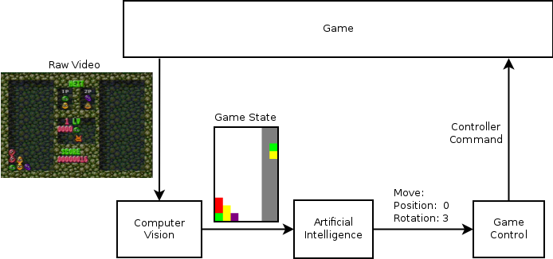

A program that plays Puyo Puyo:

...not in an emulator, it plays for real. Instead of eyes, it has a video capture card. Instead of hands it has an Arduino plugged into a controller slot.

The game is Puyo Puyo, a competitive tetris-like tile matching game. Planning combos is essential to playing the game well, so it's perfect to write an AI for. The version I use is called "Dr. Robotnik's Mean Bean Machine" on the Gamecube (in the "Sonic Mega Collection"). That's just the version I happen to have and test with.

Setup
=====

First of all, you'll need:

 * `python2.7`
 * `pyserial`
 * `numpy`
 * `OpenCV` with the `cv2` Python bindings

**TODO**

 * Arduino Setup: **TODO**
 * Video Setup: **TODO**

Usage
=====

`run.py` is the main script that runs all components in tandem. There are also
a bunch of scripts to manually test components. Use `-h` or `--help` to get
details on usage.

 * `run.py` - Plays the game. Recognizes game state through video, decides
        what move to make, and makes it.
 * `gc_send.py` - For testing Gamecube communication. Sends a command to the
        arduino controlling the Gamecube.
 * `simulate_ai.py` - For testing AIs. Reproduces the mechanics of the game and
        lets the AI make moves.
 * `simulate_board.py` - For testing the game mechanics. Allows the user to
        test the board mechanics by placing one piece at a time.
 * `recognize_board.py` - For testing the vision processing. Takes video input
        and shows the reconstructed game state.

How it Works
============

Computer Vision
---------------

The computer vision component takes raw video from a file or video capture device and outputs the current state of the game. The game state consists of a grid of beans, plus a pair of next beans.

See: [puyo/beanfinder.py](puyo/beanfinder.py)

Artificial Intelligence
-----------------------

Whenever a pair of beans start to fall, the AI is called and given the current game state. It determines the best move to make, and returns a (position, rotation) pair representing the move.

See: [puyo/ai.py](puyo/ai.py)

Game Control
------------

After the AI returns a move, the move is transmitted via serial to an Arduino, which plugs into the Gamecube. It mimicks a real controller by implementing the physical controller protocol. Once the Arduino has executed the move, the computer vision component continues to watch the raw video.

The code for the game control is split between the microcontroller and the python code:

 * [arduino/gamecube_control/](arduino/gamecube_control/)
 * [puyo/gccontrol.py](puyo/gccontrol.py)

Status
======

This is a work in progress, but it does run end-to-end. Here's the progress of
each major component:

 * Vision Processing - Works decently well, but still has some color recognition bugs.
 * Artificial Intelligence - There are some simple AIs written, but there is a lot more work to do before they are competitive.
 * Game Control - Basic functionality finished.

Milestones:

 1. ~~Simple AI controlling the game~~
 1. AI that can beat the early opponents
 1. AI that can beat me (I'm not that good)
 1. AI that can beat the final boss, Dr. Robotnik
